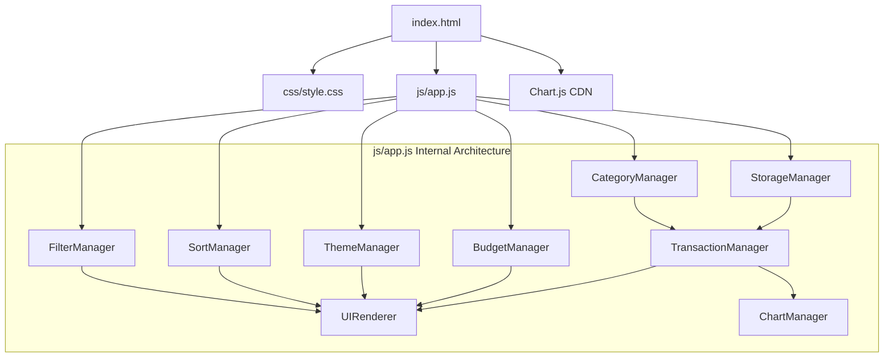
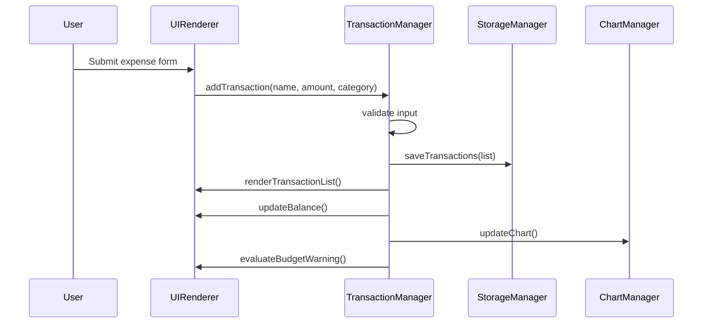

# Design Document: Expense & Budget Visualizer

## Overview

The Expense & Budget Visualizer is a client-side single-page application that enables personal expense tracking with category-based visualization. The application is built with vanilla HTML/CSS/JavaScript and uses Chart.js (via CDN) for pie chart rendering. All data persists in browser Local Storage.

### Key Design Decisions

1. **Single-file architecture**: One HTML file, one CSS file, one JS file — keeps the project simple and portable.
2. **Module pattern in JS**: Use an IIFE or module-style organization within `js/app.js` to separate concerns (data layer, UI layer, chart layer) without requiring a bundler.
3. **Local Storage as data layer**: All transactions, categories, budget limits, and theme preferences are stored as JSON in Local Storage.
4. **Chart.js via CDN with graceful degradation**: If the CDN fails to load, the app remains functional for CRUD operations.
5. **CSS custom properties for theming**: Dark/light theme switching via CSS variables toggled by a class on the `<body>` element.

## Architecture

The application follows a layered architecture within a single JavaScript file:



### Data Flow



## Components and Interfaces

### StorageManager

Handles all Local Storage read/write operations with JSON serialization.

```javascript
const StorageManager = {
  KEYS: {
    TRANSACTIONS: 'ebv_transactions',
    CATEGORIES: 'ebv_categories',
    BUDGET_LIMIT: 'ebv_budget_limit',
    THEME: 'ebv_theme'
  },

  getTransactions(): Transaction[],
  saveTransactions(transactions: Transaction[]): void,
  getCustomCategories(): string[],
  saveCustomCategories(categories: string[]): void,
  getBudgetLimit(): number | null,
  saveBudgetLimit(limit: number | null): void,
  getTheme(): 'light' | 'dark' | null,
  saveTheme(theme: 'light' | 'dark'): void
};
```

### TransactionManager

Core business logic for transaction CRUD operations.

```javascript
const TransactionManager = {
  transactions: Transaction[],

  addTransaction(name: string, amount: number, category: string): ValidationResult,
  deleteTransaction(id: string): void,
  getTotal(): number,
  getByMonth(year: number, month: number): Transaction[],
  getCategoryTotals(): Map<string, number>,
  getSorted(sortOption: SortOption): Transaction[],
  getAvailableMonths(): {year: number, month: number}[]
};
```

### CategoryManager

Manages default and custom categories.

```javascript
const CategoryManager = {
  DEFAULT_CATEGORIES: ['Food', 'Transport', 'Fun'],

  getAllCategories(): string[],
  addCustomCategory(name: string): ValidationResult,
  isValidCategory(name: string): boolean
};
```

### BudgetManager

Handles budget limit logic and warning state evaluation.

```javascript
const BudgetManager = {
  budgetLimit: number | null,

  setBudgetLimit(value: number): ValidationResult,
  clearBudgetLimit(): void,
  isOverBudget(total: number): boolean,
  getBudgetLimit(): number | null
};
```

### ChartManager

Wraps Chart.js interactions with graceful degradation.

```javascript
const ChartManager = {
  chart: Chart | null,
  isAvailable: boolean,

  initialize(canvasElement: HTMLCanvasElement): void,
  update(categoryTotals: Map<string, number>): void,
  destroy(): void,
  showUnavailableMessage(): void
};
```

### ThemeManager

Controls dark/light theme switching.

```javascript
const ThemeManager = {
  currentTheme: 'light' | 'dark',

  initialize(): void,
  toggle(): void,
  apply(theme: 'light' | 'dark'): void
};
```

### UIRenderer

Handles all DOM manipulation and event binding.

```javascript
const UIRenderer = {
  renderTransactionList(transactions: Transaction[]): void,
  updateBalance(total: number): void,
  showBudgetWarning(isOver: boolean): void,
  renderCategoryDropdown(categories: string[]): void,
  renderMonthSelector(months: {year, month}[]): void,
  showValidationError(field: string, message: string): void,
  clearValidationErrors(): void,
  showEmptyState(): void
};
```

### SortManager

Manages sort state and sorting logic.

```javascript
const SortManager = {
  currentSort: SortOption,

  sort(transactions: Transaction[], option: SortOption): Transaction[],
  getCurrentSort(): SortOption
};
```

### FilterManager

Manages month filter state.

```javascript
const FilterManager = {
  activeMonth: {year: number, month: number} | null,

  setMonth(year: number, month: number): void,
  clearFilter(): void,
  getActiveMonth(): {year: number, month: number} | null
};
```

## Data Models

### Transaction

```javascript
{
  id: string,          // Unique identifier (UUID or timestamp-based)
  name: string,        // Item name, 1-50 characters, trimmed
  amount: number,      // Positive number, 0.01 to 9,999,999.99, 2 decimal places
  category: string,    // Must match an existing category
  date: string,        // ISO 8601 date string (YYYY-MM-DD), auto-assigned on creation
  createdAt: number    // Unix timestamp for ordering
}
```

### ValidationResult

```javascript
{
  valid: boolean,
  errors: { field: string, message: string }[]
}
```

### SortOption (enum)

```javascript
'default'          // Reverse chronological (most recent first)
'amount-desc'      // Highest amount first
'amount-asc'       // Lowest amount first
'category-asc'     // Alphabetical by category, then highest amount within
```

### Local Storage Schema

| Key | Type | Description |
|-----|------|-------------|
| `ebv_transactions` | `Transaction[]` | Array of all transaction objects |
| `ebv_categories` | `string[]` | Array of custom category names |
| `ebv_budget_limit` | `number \| null` | Budget limit value or null |
| `ebv_theme` | `'light' \| 'dark'` | Theme preference |

### Color Palette for Chart Categories

Each category is assigned a color from a predefined palette. Colors are assigned in order of category creation. The palette provides at least 10 distinct colors with sufficient contrast for both light and dark themes.


## Correctness Properties

*A property is a characteristic or behavior that should hold true across all valid executions of a system — essentially, a formal statement about what the system should do. Properties serve as the bridge between human-readable specifications and machine-verifiable correctness guarantees.*

### Property 1: Valid transaction addition grows the list

*For any* valid transaction input (non-empty trimmed name ≤50 chars, amount between 0.01 and 9,999,999.99, and a valid category), adding it to the transaction list should result in the list length increasing by exactly one, and the new transaction should appear in the list with matching name, amount, and category.

**Validates: Requirements 1.3**

### Property 2: Whitespace-only names are rejected

*For any* string composed entirely of whitespace characters (spaces, tabs, newlines, or empty string), attempting to add a transaction with that string as the name should be rejected by validation, and the transaction list should remain unchanged.

**Validates: Requirements 1.4**

### Property 3: Invalid amounts are rejected

*For any* amount value that is zero, negative, NaN, Infinity, or exceeds 9,999,999.99, attempting to add a transaction with that amount should be rejected by validation, and the transaction list should remain unchanged.

**Validates: Requirements 1.5**

### Property 4: Transaction deletion removes exactly the target

*For any* non-empty transaction list and any transaction in that list, deleting that transaction should result in the list length decreasing by exactly one, the deleted transaction no longer appearing in the list, and all other transactions remaining unchanged.

**Validates: Requirements 3.1**

### Property 5: Balance invariant

*For any* set of transactions, the computed total balance should always equal the sum of all transaction amounts in the list, formatted to two decimal places. This must hold after any addition or deletion.

**Validates: Requirements 3.2, 4.2, 4.4, 4.5**

### Property 6: Category totals invariant

*For any* set of transactions, the computed category totals should equal the sum of amounts grouped by category, each category's percentage should equal its total divided by the grand total times 100, and all percentages should sum to 100% (within floating-point tolerance). Categories with zero total should not appear.

**Validates: Requirements 3.3, 5.1, 5.3**

### Property 7: Transaction serialization round-trip

*For any* list of valid transactions, serializing to Local Storage (JSON) and then deserializing should produce a list of transactions with identical id, name, amount, category, and date fields for each transaction.

**Validates: Requirements 6.1, 6.2, 6.3, 6.4**

### Property 8: Malformed storage data handled gracefully

*For any* arbitrary string (including invalid JSON, partial objects, null, undefined, arrays of wrong types), loading transactions from Local Storage containing that data should return an empty transaction list without throwing an error.

**Validates: Requirements 6.5**

### Property 9: Valid custom category addition

*For any* valid category name (1-30 characters, not whitespace-only, not matching any existing category case-insensitively), adding it should result in it appearing in the full category list.

**Validates: Requirements 7.2**

### Property 10: Whitespace-only categories are rejected

*For any* string composed entirely of whitespace characters or empty string, attempting to add it as a custom category should be rejected, and the category list should remain unchanged.

**Validates: Requirements 7.3**

### Property 11: Duplicate categories are rejected (case-insensitive)

*For any* existing category name and any case variation of that name (uppercase, lowercase, mixed), attempting to add the variation as a new category should be rejected, and the category list should remain unchanged.

**Validates: Requirements 7.4**

### Property 12: Category serialization round-trip

*For any* list of valid custom category names, serializing to Local Storage and then deserializing should produce an identical list of category names.

**Validates: Requirements 7.5, 7.6**

### Property 13: Month filter correctness

*For any* set of transactions spanning multiple months and any selected month, filtering by that month should return only transactions whose date falls within that calendar month, the filtered total should equal the sum of those filtered transactions' amounts, and no transaction from that month should be excluded.

**Validates: Requirements 8.3, 8.4**

### Property 14: Available months matches transaction dates

*For any* set of transactions, the list of available months should contain exactly the set of distinct (year, month) pairs present in the transaction dates — no more, no less.

**Validates: Requirements 8.2**

### Property 15: Sort by amount descending

*For any* list of transactions, sorting by amount descending should produce a list where each transaction's amount is greater than or equal to the next transaction's amount.

**Validates: Requirements 9.2**

### Property 16: Sort by amount ascending

*For any* list of transactions, sorting by amount ascending should produce a list where each transaction's amount is less than or equal to the next transaction's amount.

**Validates: Requirements 9.3**

### Property 17: Sort by category alphabetical with secondary sort

*For any* list of transactions, sorting by category should produce a list where categories appear in alphabetical (A-Z) order, and within the same category, transactions are ordered from highest to lowest amount.

**Validates: Requirements 9.4**

### Property 18: Budget warning correctness

*For any* total expense amount and any budget limit value, the warning indicator should be shown if and only if the total exceeds the budget limit (total > limit).

**Validates: Requirements 10.3, 10.4**

### Property 19: Invalid budget values are rejected

*For any* budget value that is zero, negative, NaN, or empty, attempting to set it as the budget limit should be rejected, and the previous budget limit value should be retained.

**Validates: Requirements 10.2**

### Property 20: Budget limit persistence round-trip

*For any* valid budget limit value (0.01 to 999,999,999.99), saving it to Local Storage and loading it back should produce the same numeric value.

**Validates: Requirements 10.5, 10.6**

### Property 21: Theme toggle is an involution

*For any* starting theme (light or dark), toggling the theme should produce the opposite theme, and toggling twice should return to the original theme. The persisted value should always match the current applied theme.

**Validates: Requirements 11.2, 11.3, 11.4**

### Property 22: Transaction rendering contains all fields

*For any* valid transaction, the rendered output for that transaction should contain the transaction's name, its amount formatted to exactly two decimal places, and its category name.

**Validates: Requirements 2.1**

### Property 23: Default display order is reverse chronological

*For any* list of transactions with distinct creation timestamps, the default display order should have each transaction's createdAt timestamp greater than or equal to the next transaction's createdAt timestamp (most recent first).

**Validates: Requirements 2.2**

## Error Handling

### Input Validation Errors

| Error Condition | User Feedback | Recovery |
|----------------|---------------|----------|
| Empty/whitespace item name | Inline error message below name field | User corrects and resubmits |
| Invalid amount (zero, negative, NaN, too large) | Inline error message below amount field | User corrects and resubmits |
| No category selected | Inline error message below category dropdown | User selects and resubmits |
| Empty/whitespace category name | Inline error message below category input | User corrects and resubmits |
| Duplicate category name | Inline error message indicating duplicate | User enters different name |
| Invalid budget limit | Inline error message below budget input | Previous value retained |

### Storage Errors

| Error Condition | Behavior | Recovery |
|----------------|----------|----------|
| Local Storage unavailable (private browsing) | App functions normally without persistence | Data lost on page refresh |
| Malformed data in Local Storage | Silently reset to empty state | User starts fresh |
| Local Storage quota exceeded | Display non-blocking warning | User can delete transactions to free space |

### Chart.js CDN Failure

| Error Condition | Behavior | Recovery |
|----------------|----------|----------|
| Chart.js fails to load | Pie chart area shows "Chart unavailable" message | All other features remain functional |
| Chart.js throws runtime error | Catch error, show fallback message | CRUD operations unaffected |

### Floating-Point Precision

All monetary calculations use `Math.round(value * 100) / 100` to avoid floating-point drift. Totals are computed by summing raw values and rounding once at display time.

## Testing Strategy

### Property-Based Testing

**Library**: [fast-check](https://github.com/dubzzz/fast-check) (JavaScript property-based testing library)

**Configuration**:
- Minimum 100 iterations per property test
- Each test tagged with: `Feature: expense-budget-visualizer, Property {number}: {property_text}`

**Scope**: All 23 correctness properties above will be implemented as property-based tests targeting the pure logic layer (TransactionManager, CategoryManager, BudgetManager, SortManager, FilterManager, StorageManager serialization).

### Unit Tests (Example-Based)

Focus on specific scenarios and edge cases:
- Default categories are exactly Food, Transport, Fun
- Empty transaction list shows placeholder message
- Delete button exists for each rendered transaction
- Last transaction deletion shows zero balance and empty state
- Chart.js CDN failure shows fallback message
- Default theme is light when no preference stored
- Sort control has correct options
- Budget input field accepts correct range
- Date auto-assignment on transaction creation

### Integration Tests

- Full add → display → persist → reload cycle
- Chart updates after add/delete (Chart.js integration)
- Theme toggle persists and applies on reload
- Month filter auto-clears when filtered month becomes empty

### Accessibility Testing

- axe-core automated audit for WCAG 2.1 AA compliance
- Contrast ratio verification for both themes
- Touch target size verification (44x44px minimum)
- Keyboard navigation through all interactive elements

### Responsive Design Testing

- Layout verification at 768px, 1024px, and 1440px viewports
- Vertical stacking at 768-1023px
- No horizontal scrolling at any supported viewport width
